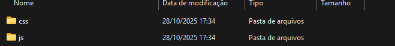

Recomendo baixar a versão mais atual no momento em que você esta vendo isso, porém deixarei os arquivos que utilizei na data que estou criando este repositório.
Caso haja algum erro ou algo do tipo, podem abrir uma Issue colocando como titulo o problema e erro que esta tendo.

O Bootstrap vai auxiliar e facilitar muito o desenvolvimento do front-end, como mostrarei a seguir:

Após baixar o arquivo em zip (normalmente o site vai te disponibilizar o download zipado) copie ele (ctrl + C ou botão direito do mouse e clique na opção copiar) e cole (ctrl + V ou botão direito do mouse e clique na opção colar) para o caminho do arquivo (.../xampp/htdocs/projeto_crud), extraia ele e deixe apenas as pastas "js" e "css" como na imagem a seguir.
Clique aqui para 

**NENHUMA ALTERAÇÃO É NECESSÁRIA NAS PASTAS "js" E "css"**